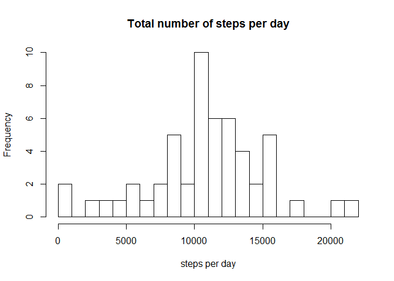
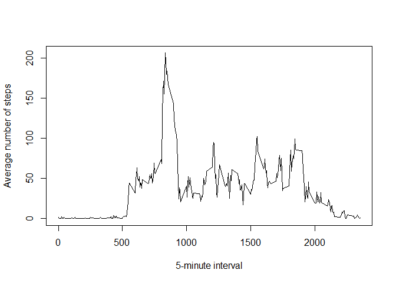
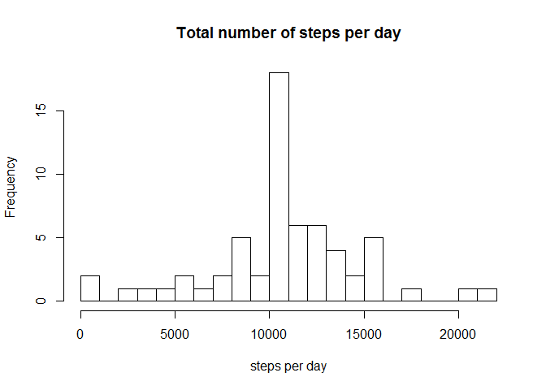
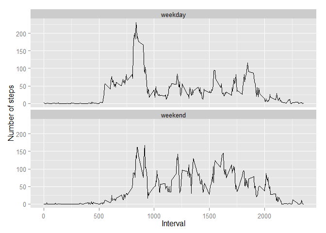

# Reproducible Research: Peer Assessment 1


## Loading and preprocessing the data

Load activity data


```r
fileName<-"activity.csv"
activity<-read.csv(fileName)
str(activity)
```

```
## 'data.frame':	17568 obs. of  3 variables:
##  $ steps   : int  NA NA NA NA NA NA NA NA NA NA ...
##  $ date    : Factor w/ 61 levels "2012-10-01","2012-10-02",..: 1 1 1 1 1 1 1 1 1 1 ...
##  $ interval: int  0 5 10 15 20 25 30 35 40 45 ...
```

Transform date field in data frame to Date


```r
activity$date<-as.Date(activity$date)
```

Remove missing values


```r
good<-complete.cases(activity)
data<-activity[good,]
```


## What is mean total number of steps taken per day?

Number of steps per day


```r
library(dplyr)
```

```
## 
## Attaching package: 'dplyr'
## 
## The following object is masked from 'package:stats':
## 
##     filter
## 
## The following objects are masked from 'package:base':
## 
##     intersect, setdiff, setequal, union
```

```r
steps_per_day<-summarise(group_by(data,date),steps=sum(steps))
hist(steps_per_day$steps,xlab="steps per day",main="Total number of steps per day",breaks=seq(from = 0 , to = 22000, by = 1000))
```

 

__Mean__ and __Median__ of total number of steps per day


```r
mean_and_median<-summarise(steps_per_day,mean=mean(steps),median=median(steps))
mean_and_median
```

```
## Source: local data frame [1 x 2]
## 
##    mean median
## 1 10766  10765
```


## What is the average daily activity pattern?

Average number of steps across all days


```r
steps_per_interval_mean<-summarise(group_by(data,interval),steps=mean(steps))
with(steps_per_interval_mean,plot(interval,steps,type="l",xlab="5-minute interval",ylab="Average number of steps"))
```

 

Interval with maximum number of steps


```r
max_number_steps<-steps_per_interval_mean[steps_per_interval_mean$steps==max(steps_per_interval_mean$steps),][]
max_number_steps
```

```
## Source: local data frame [1 x 2]
## 
##   interval steps
## 1      835 206.2
```


## Imputing missing values

Number of missing values in dataset


```r
missing_values<-!complete.cases(activity)
number_of_missing_values<-nrow(activity[missing_values,])
number_of_missing_values
```

```
## [1] 2304
```

Filing missing values, two datasets are created to fill in all missing values :

1. __missing_data__, this set cotains all missing data
2. __steps_mean_per_interval__, this set holds the steps mean for all the intervals across all days

the aformentioned sets are merged and transformed to create a new set with all missing data filled in


```r
steps_mean_per_interval<-summarise(group_by(data,interval),steps=as.integer(mean(steps)))
missing_data<-activity[missing_values,]
merged_data<-merge(missing_data,steps_mean_per_interval,by="interval")
filled_data<-arrange(transmute(merged_data,steps = steps.y,date,interval),date)
all_data<-arrange(rbind(data,filled_data),date)
```


Total number of steps per day


```r
all_steps_per_day<-summarise(group_by(all_data,date),steps=sum(steps))
hist(all_steps_per_day$steps,xlab="steps per day",main="Total number of steps per day",breaks=seq(from = 0 , to = 22000, by = 1000))
```

 


__Mean__ and __Median__ of total number of steps per day


```r
all_mean_and_median<-summarise(all_steps_per_day,mean=mean(steps),median=median(steps))
all_mean_and_median
```

```
## Source: local data frame [1 x 2]
## 
##    mean median
## 1 10750  10641
```

The __Mean__ and __Median__ values differ, by imputting missing data both values decreased.


```
## Source: local data frame [1 x 2]
## 
##    mean median
## 1 10750  10641
```

```
## Source: local data frame [1 x 2]
## 
##    mean median
## 1 10766  10765
```


## Are there differences in activity patterns between weekdays and weekends?

New day of week factor added to dataset


```r
new_data<-mutate(all_data,dayofweek = weekdays(date) %in% c("Saturday","Sunday"))
new_data$dayofweek<-gsub(FALSE,"weekday",new_data$dayofweek)
new_data$dayofweek<-gsub(TRUE,"weekend",new_data$dayofweek)
new_data$dayofweek<-as.factor(new_data$dayofweek)
```

Average number of steps across all weekdays and weekends


```r
library(ggplot2)
```

```
## Warning: package 'ggplot2' was built under R version 3.1.2
```

```r
steps_per_interval_per_dayofweek<-summarise(group_by(new_data,interval,dayofweek),steps=mean(steps))
g<-ggplot(steps_per_interval_per_dayofweek,aes(interval,steps))
g + geom_line() + facet_wrap(~dayofweek,nrow=2) + ylab("Number of steps") + xlab("Interval")
```

 
